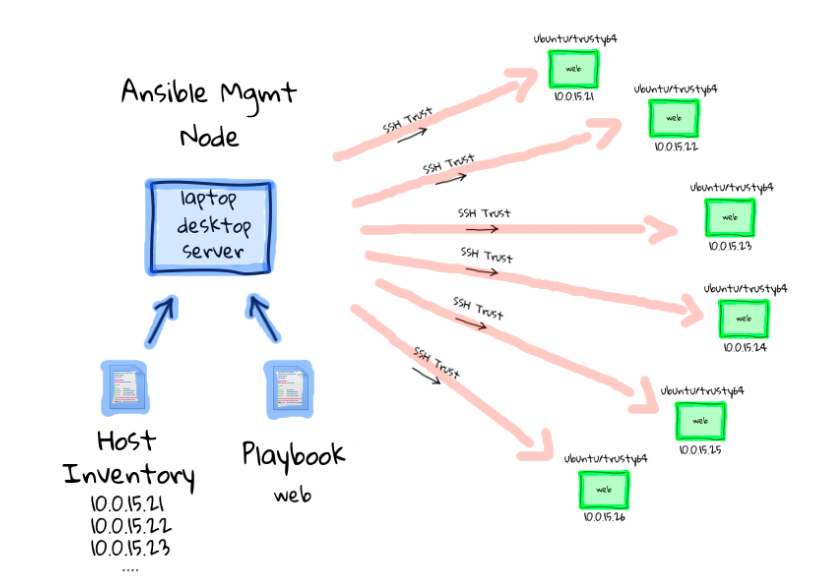

# Infrastructure as code (IaC)

## Requirement of automatisation

- Increasingly crucial to automate   
  Applications can be deployed up to hundreds of times per day
- Infrastructure is fleeting   
  It can be provisioned or deprovisioned in response to load

## Example

1. An application on a public cloud:
  - build on Kubernetes
  - bring on a VM (some legacy)
  - and add VPC to connect them
  
2. Then you need an exactly the same test environment
  - manual repeating documented steps may contain human-factor errors 

## Imperative approach

Intuitive, step-by-step way.

**Example:**

CLI along with a bash script like:   
  ```
  cli create k8s
  ...
  cli create vm
  ...
  cli create vpc
  ...
  ```

**Disadvantages:**

  - when you need to scale it up or down you need to write custom scripts
  - doesn't scale well
  - if you run multiple times, it will create each time
  - you have to add error handling when one of the steps halfway failed

## Declarative approach

- Define the final state of your infrastructure
- It lets the provider to handle the rest
- managed through simple config maps

```
k8s resource
  host: ...
vm resource
  domain: ...
vpc resource
  subnets: ...
...
```

**Advantages:**

- no mater how many times you run the script you end up with the same infrastructure
  example: run later to insure the infra hasn't changed

## Implementation in DevOps 

**Example:** 

Perfect agile DevOps flow:
  -> write code
  -> test
  -> deploy to production

With a legacy infrastructure:
  - you have to open a ticket when you need a new VM
  - that holds you back
  
With IaC (best approach):
  - you treat the infrastructure with the same quality as you treat your code
  - versioning
  - track changes

## Immutable & mutable infrastructure

**Example:**
- you add a database to your infrastructure: k8s, VM, VPC and + database
- and scale it 1000 times

**Mutable approach** - environment (configuration) drift
  Move the infra from V1 to V2 with a mutation **custom script**
  
  - 99% it is working, but 1% failing in a limbo state
  - existing environment no longer matching what we have in our automation automation
  - to debug you would have to:   
    - wipe out the entire environment
    - redeploy V1
    - run those scripts
  - when moving to scale it becomes incredibly hard to maintain

**Immutable approach** - a new environment alongside the old one
  - when they both working you bring down the older version
  - it is expensive (V1 and V2 are running at the same time)
  - but it's a best practice to ensure that your infra can move to scale

## Managing development virtual environment with Vagrant

**Vagrant** - a tool for building and managing virtual machine environments in a single workflow.

Benefits:
- automate prod-like environments
- easy to configure
- portable

## Vagrant components

- **host** and **guest** machines 
- **Vagrantfile** - configuration (on Ruby)
- **Box** - OS and version
- **Providers** - VM hipervisor (VirtualBox, VMware, libvirt)
- **Provisioners**:
  - shell
  - **Ansible**
  - Chef
  - Puppet
  - ...
  
## Vagrant basic commands

- `vagrant up` - Start and provision VM
- `vagrant destroy` - Destroy VMs
- `vagrant status` - Check VMs status
- `vagrant ssh VM_NAME` - SSH as the vagrant user
- `vagrant halt` - stop the VMs

## Cloud provisioning with Terraform

- By HashiCorp (same company as Vagrant)
- Manage all kind of Cloud objects:
  - Machines/Containers
  - Networks
  - Services
  - Clusters
- Work with all Cloud providers: Azure, AWS, GCP, Alibaba Cloud ...

## Provisioning with Ansible 

Ansible is a **automation engine** that automates:

  - cloud provisioning
  - configuration management
  - application deployment
  - intra-service orchestration
  - many other IT needs ...
  
**Advantages:**

  - no-agent to install on machines, only SSH only
  - write configuration (playbooks) on YAML - easy to learn
  
## Ansible components

- **Module** - units of code providing a narrow functionality (e.g. the `yum` module installs packages using the yum package manager)
- **Task** - execution of one module with a set of arguments
- **Playbook** - set of tasks in YAML
- **Role** - set of playbooks to be run on a group of hosts
- **Host** - a machine that Ansible will configure through SSH
- **Inventory** - definition of the hosts and variables to be used in the playbooks



## Example Ansible project tree

```
run.yml
roles/
    common/
        tasks/
        handlers/
        files/
        templates/
        vars/
        defaults/
        meta/
    webservers/
        tasks/
        defaults/
        meta/
```

## Ansible variables

Ansible variables:
```yaml
postgres:
  host: psql.toto.com
  port: 5432
  timezone: Europe/Paris
  databases:
    - toto
    - tata
```

Ansible debug message:

```yaml
- debug:
  msg: "{{postgres.host}}: {{postgres.port}}"
```

Output:

```
ok: [server] => { 
  "msg": "psql.toto.com:5432" 
}
```

[Read more](https://docs.ansible.com/ansible/latest/user_guide/playbooks_templating.html) about Jinja2 templating.
