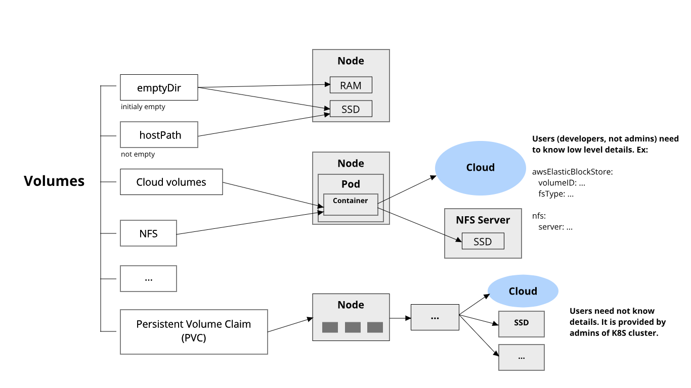

# Storage in Kubernetes

## Volumes in Docker

- is simply a directory on disk or in another Container
- lifetimes are not managed

## Kubernetes Volumes

- has an explicit lifetime - the same as the Pod that encloses it
- a volume outlives any Containers that run within the Pod
- when a Pod ceases to exist, the volume will cease to exist, too. 
- Kubernetes supports many types of volumes, and a Pod can use any number of them simultaneously.

[Read more](https://kubernetes.io/docs/concepts/storage/volumes/)

## Kubernetes Volume types



## Volume type: emptyDir

```
apiVersion: v1
kind: Pod
metadata:
  name: redis
spec:
  containers:
  - name: redis
    image: redis
    volumeMounts:
    - name: redis-storage
      mountPath: /data/redis
  volumes:
  - name: redis-storage
    emptyDir: {}
```

## Volume type: awsElasticBlockStore

```
apiVersion: v1
kind: Pod
metadata:
  name: test-ebs
spec:
  containers:
  - image: k8s.gcr.io/test-webserver
    name: test-container
    volumeMounts:
    - mountPath: /test-ebs
      name: test-volume
  volumes:
  - name: test-volume
    # This AWS EBS volume must already exist.
    awsElasticBlockStore:
      volumeID: "<volume id>"
      fsType: ext4

```

## Persistent Volumes

Provides an API for users and administrators that abstracts details of how storage is provided from how it is consumed.

have a lifecycle independent of any individual Pod that uses the PV

2 parts:

1. **PersistentVolumeClaim (PVC)** - a request for storage **by a user**.

```
apiVersion: v1
kind: PersistentVolumeClaim
metadata:
  name: foo-pvc
  namespace: foo
spec:
  storageClassName: "" # Empty string must be explicitly set otherwise default StorageClass will be set
  volumeName: foo-pv
  ...
```

2. **PersistentVolume (PV)** - a piece of storage in the cluster that has been **provisioned by an administrator**. It has a lifecycle independent of any individual Pod that uses the PV.

```
apiVersion: v1
kind: PersistentVolume
metadata:
  name: foo-pv
spec:
  storageClassName: ""
  claimRef:
    name: foo-pvc
    namespace: foo
  ...
```

[Read more](https://kubernetes.io/docs/concepts/storage/persistent-volumes/)
