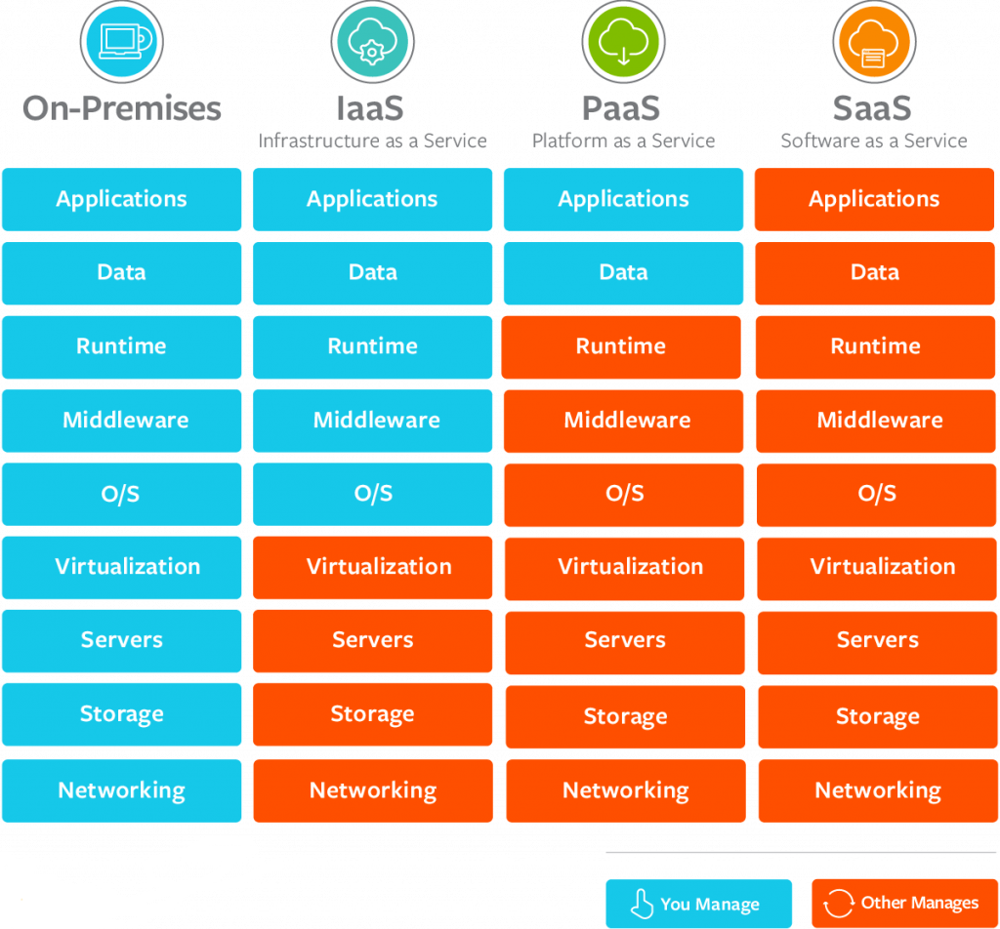
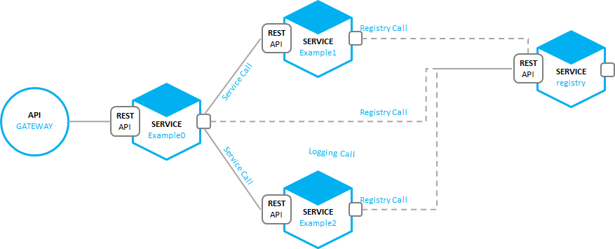
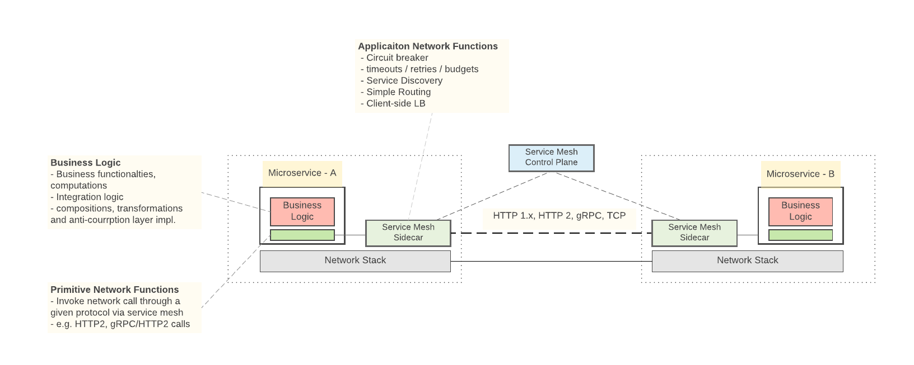
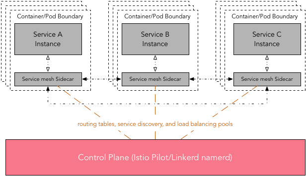
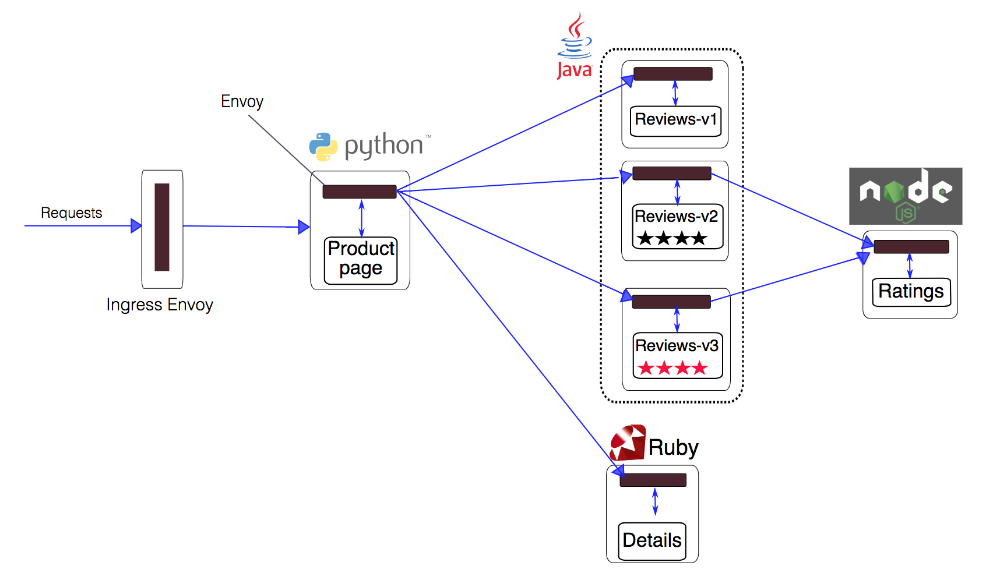
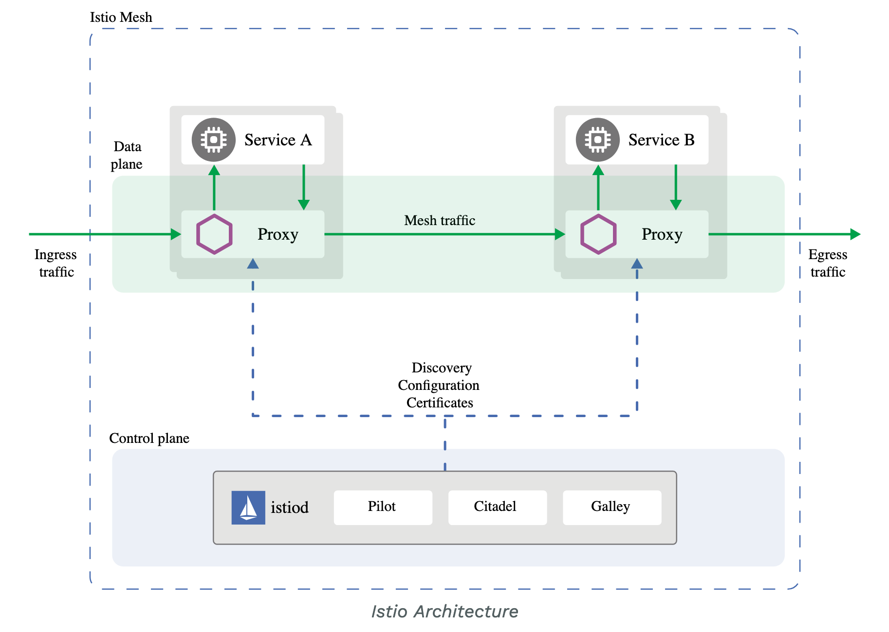

# Cloud-native applications

## What is Cloud?

- remote data centres
- offers software or hardware to a business or individual
- you can access through the Internet

## Why business is moving to the Cloud?

- **Flexibility and agility**   
  Cloud computing makes it easy to quickly scale up/down the capacity.
- **Security**   
  Implement effective disaster recovery solutions without large, upfront investments.
- **Automatic software and hardware updates**   
  The servers and maintained by your supplier.
- **Saves the money on hardware, “pay as you go”**
- **Increased collaboration**   
  Team members can work anywhere.
- **Сompetitive advantage**
  Small business have access to enterprise-class technology it couldn’t afford on its own.

[Read more](https://www.pointclick.net/moving-to-the-cloud/)

## Choose your service model

- How much you can and want **to manage yourself**?
- How much you want **your service provider to manage**?

Match services yourself: DigitalOcean, Wix, Heroku, Shopify, Amazon Web Services (AWS), Salesforce, Google Cloud Platform (GCP), GitHub, Youtube, GitLab, Travis CI, IBM cloud, Trello.

[Read more](https://www.bmc.com/blogs/saas-vs-paas-vs-iaas-whats-the-difference-and-how-to-choose/_

## What are cloud-native applications?

Cloud-native applications are:
- a collection of small, independent, and loosely coupled services
- provide a consistent development and automated management
- designed to run in the cloud.

**Key attributes of cloud-native:**

1. Packaged as lightweight **containers**
2. Developed with best-of-breed **languages and frameworks**
3. Designed as **loosely coupled microservices**

**Other attributes:**

4. **Centered around APIs** for interaction and collaboration
5. **Architected** with a clean separation of **stateless and stateful** services
6. **Isolated** from server and operating system dependencies
7. **Deployed** on self-service, elastic, cloud infrastructure
8. **Managed** through agile DevOps processes   
  Each service has an independent life cycle and CI/CD.
9. **Automated** capabilities
10. Defined, policy-driven resource allocation

[Read more](https://thenewstack.io/10-key-attributes-of-cloud-native-applications/)

## Monolithic vs Microservices architecture

**Microservices** - a style that structures an application as a collection of services that are:

- highly maintainable and testable
- [loosely coupled](https://en.wikipedia.org/wiki/Loose_coupling)
- independently deployable
- organized around business capabilities
- owned by a small team
- sourced as a separate Git repo with its own tests

**Monolithic** - a style where single-tiered software application in which different components combined into a single program from a single platform.

## Application centered around APIs

## Service mesh

**Service mesh** - an infrastructure layer for facilitating service-to-service communications between microservices, often using a **sidecar proxy**.

**Provides:**

  - Connection between microservices
  - Monitoring, observability into communications
  - Securing
  - Managing

## Service mesh architecture

Platforms implementing service mesh:

  - **Istio**
  - Consul
  - Linkerd

## Service mesh example

  
## Real large examples of service mesh 

## Istio

**Istio** - a platform that implements service mesh (provides a uniform way to secure, connect, and monitor microservices).

## What you can do with Istio?

Istio provides operational requirements:

- canary rollout (deployment)
- A/B testing
- rate limiting
- access control
- end-to-end authentication
